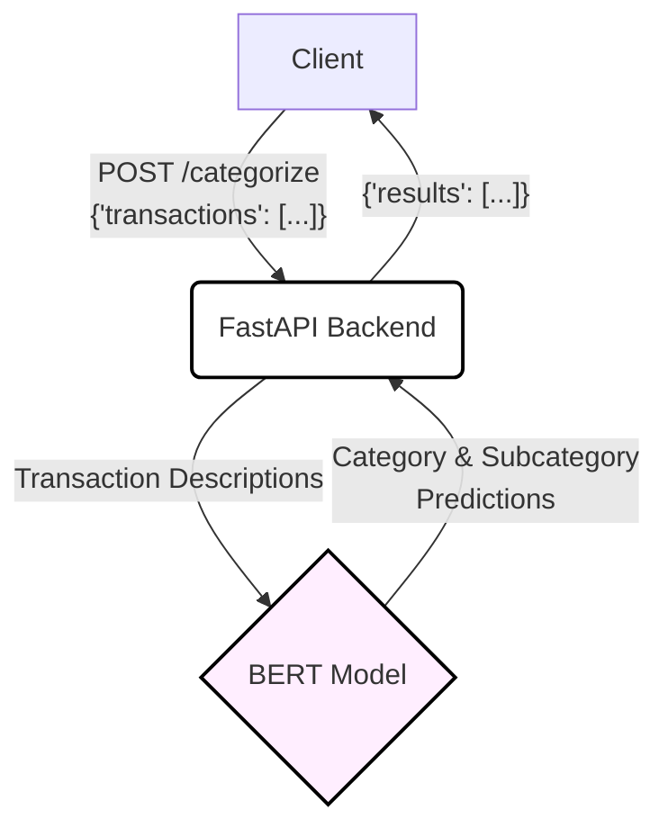

# Bank-Transaction-Categorizer-v2

[](https://opensource.org/licenses/MIT)

A self-hosted, privacy-focused API for categorizing your bank transactions using a fine-tuned BERT model. Your data stays yours.



---

## ✨ Key Features

- **🔒 Privacy First:** Self-host the API to ensure your financial data never leaves your infrastructure.
- **🤖 State-of-the-Art NLP:** Leverages a fine-tuned BERT model for highly accurate transaction categorization.
- **🚀 Simple REST API:** Easy to integrate into any application with a straightforward POST request.
- **🔧 Fully Customizable:** Add, remove, or change categories and subcategories to fit your exact needs. Retrain the model with a single command.
- **💻 Backend Only:** No unnecessary GUI. A pure, powerful backend ready for your projects.

---

## 🚀 Getting Started

### 1. Install Dependencies
```bash
pip install -r requirements.txt
```

### 2. Train the Model
This project is ready to go with a default dataset. To train the model on the included data, simply run:
```bash
python scripts/train_models.py
```
- By default, this script uses `data/main.csv` and saves models to `models/pt_cat_modelV1` and `models/pt_sub_modelV1`.
- If you have limited RAM, consider adjusting the `BATCH_SIZE` in `scripts/train_models.py`.

### 3. Run the API
```bash
uvicorn api:app --reload
```
The API will be available at `http://127.0.0.1:8000`.

---

## Usage

Send a `POST` request to the `/categorize` endpoint with a list of transactions.

**Request:**
```json
POST /categorize
{
  "transactions": [
    {"Description": "Starbucks Coffee"},
    {"Description": "Shell Gas Station"}
  ]
}
```

**Response:**
```json
{
  "results": [
    {
      "Description": "Starbucks Coffee",
      "Category": "Food",
      "Subcategory": "Fast_Food"
    },
    {
      "Description": "Shell Gas Station",
      "Category": "Auto",
      "Subcategory": "Gas"
    }
  ]
}
```

---

## 🏷️ Categories & Subcategories

The default categories and subcategories are defined in `utils/dicts.py`.

<details>
<summary>View Default Categories</summary>

```python
categories = {
    # Financial Transactions
    'Transfers_Internal_Movement': [
        'Bank_Transfer_To_Checking', 'Bank_Transfer_From_Checking',
        'Bank_Transfer_To_Savings', 'Bank_Transfer_From_Savings',
        'External_Transfer', 'Keep_the_Change_Transfer', 'Overdraft_Protection'
    ],
    'P2P_Digital_Wallets': ['Cash_App', 'Zelle', 'Venmo'],
    'Investments_Crypto': ['Brokerage_Investments', 'Crypto_Exchange'],
    'Income_Credits': ['Payroll_Income', 'Cashback_Statement_Credits', 'Zelle_P2P_Received', 'Deposit'],
    'Fees_Interest': ['Bank_Fees', 'Interest_Charged_Purchases', 'Interest_Charged_Cash_Advance'],

    # Payments
    'Credit_Card_Loan_Payments': ['Credit_Card_Payment', 'Auto_Loan_Payment', 'BNPL', 'Installment_Loan'],
    'Utilities_Recurring_Bills': ['Electric', 'Insurance', 'Phone_Internet'],
    'Legal_Government': ['Court_Ticket_Payments', 'Tax_Payments_Refunds'],

    # Purchases & Spending
    'Food': ['Groceries', 'Dining_Restaurants', 'Fast_Food', 'Food_Delivery'],
    'Auto': ['Gas', 'Auto_Maintenance', 'Other_Auto'],
    'Travel': ['Activities', 'Car_Rental', 'Flights', 'Hotels', 'Ride_Sharing'],
    'Electronics': ['Accessories', 'Computer', 'Electronics_misc', 'TV', 'Tablet_Watch'],
    'Entertainment': ['Arts_Crafts', 'Games', 'Guns', 'Entertainment_Sports_Outdoors', 'Books', 'DateNights', 'E_Other', 'Movies_TV'],
    'Clothes': ['Clothes_Clothes', 'Bags_Accessories', 'Jewelry', 'Shoes'],
    'Personal_Care': ['Beauty', 'Makeup_Nails', 'PC_Other', 'Personal_Care_Sports_Outdoors', 'Vitamins_Supplements', 'Hair', 'Massage'],
    'Baby': ['Baby_Clothes', 'Diapers', 'Formula', 'Other_Baby', 'Toys'],
    'Home': ['Decor', 'Furniture_Appliances', 'Home_Gym', 'Home_Essentials', 'Hygiene', 'Kitchen', 'Home_Maintenance', 'Security', 'Tools', 'Yard_Garden'],
    'Medical': ['Health_Wellness'],
    'Kids': ['K_Toys'],
    'Pets': ['Pet_Food', 'Pet_Grooming', 'Pet_Med', 'Pet_Other', 'Pet_Toys'],
    'Subscriptions_Memberships': ['Entertainment', 'Subscriptions_Memberships_Gym', 'Sub_Other'],
    
    'Shopping': ['General_Merchandise'],

    # Miscellaneous
    'Unclassified_Miscellaneous': ['Unknown', 'Other_Services'],
}
```
</details>

---

## 🛠️ Customization & Retraining

You can easily train the model on your own data for higher accuracy and custom categories.

1.  **Edit Categories:** Modify `utils/dicts.py` to define your desired categories and subcategories.
2.  **Prepare Data:** Create a CSV file (e.g., `data/my_transactions.csv`) with `Description`, `Category`, and `Sub_Category` columns.
3.  **Retrain Model:** Open `scripts/train_models.py`, update the `DATA_FILE` path to point to your new CSV, and run the script:
    ```bash
    python scripts/train_models.py
    ```
4.  **Restart the API** to load the newly trained model.

---

## 🏗️ Project Structure

-   `api.py`: The FastAPI application entry point.
-   `utils/`: Core logic including model prediction (`model.py`), data preparation (`data_prep.py`), and category definitions (`dicts.py`).
-   `scripts/`: Standalone scripts for training the model (`train_models.py`) and other data utilities.
-   `models/`: Directory where trained model files are saved.
-   `data/`: Your training data (CSV files).

---

## ⚡ Performance

-   Trained on over 62,000 transactions using a BERT-base model.
-   Inference on a Raspberry Pi 4 (8GB) takes ~2–8 seconds per transaction. Batching is supported for better performance.
-   For faster inference, consider replacing the BERT model with a lighter alternative like DistilBERT or TinyBERT.

---

## 🔮 Roadmap

-   [ ] Support for lightweight models (DistilBERT, TinyBERT).
-   [ ] Export to ONNX / TensorFlow Lite for improved performance on edge devices.
-   [ ] Containerized deployment with Docker.
-   [ ] More granular default categories (e.g., for Utilities, Insurance, Income).

---

## 🤝 Contributing

Pull requests and issues are welcome! If you find this project useful, please consider starring the repository.

---

## 📄 License

This project is licensed under the MIT License. See the [LICENSE](LICENSE) file for details.
